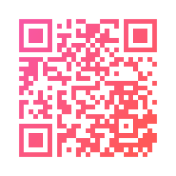

# React svg qrcode component

Install:
```sh
npm install react-qrcode-svg
```

Import:
```js
import QrCode from 'react-qrcode-svg';
```

Use:
```js
const App = () => (
  <QrCode
    data="https://github.com/dral/react-qrcode-svg"
    height="300"
    width="300"
    fgColor="#A1B2C3"
    bgColor="#123456"
  />
);
```

## Options

- `data`: the data to encode
- `ecLevel`: Error correction level, any of `L`, `M`, `Q`, `H` (default 'L');
- `fgColor`: Foreground color (default: `#000`)
- `bgColor`: Background color (default: `none`, transparent background)
- `margin`: Margin or _quiet zone_ arround code in number of modules (default `4`).
- other: Any other properties (`height`, `width`, …) will be passed to the underlying `svg` component.

## Gradient fills

Children elements can be used to define more advanced svg attributes such as [gradient fills](https://developer.mozilla.org/en-US/docs/Web/SVG/Tutorial/Gradients):

```js
const App = () => (
  <QrCode
    data="https://github.com/dral/react-qrcode-svg"
    height="300"
    width="300"
    fgColor="url(#gradientFill)"
  >
    <linearGradient id="gradientFill" x1="0" y1="0" x2="1" y2=".7">
      <stop offset="0%" stopColor="#f857a6"/>
      <stop offset="100%" stopColor="#ff5858"/>
    </linearGradient>
  </QrCode>
);
```

Produces:
```xml
<svg ...>
  <linearGradient id="gradientFill" x1="0" y1="0" x2="1" y2=".7">
    <stop offset="0%" stop-color="#f857a6"></stop>
    <stop offset="100%" stop-color="#ff5858"></stop>
  </linearGradient>
  <rect x="-4" y="-4" width="37" height="37" fill="none"></rect>
  <path d="..." fill="url(#gradientFill)"></path>
</svg>
```


